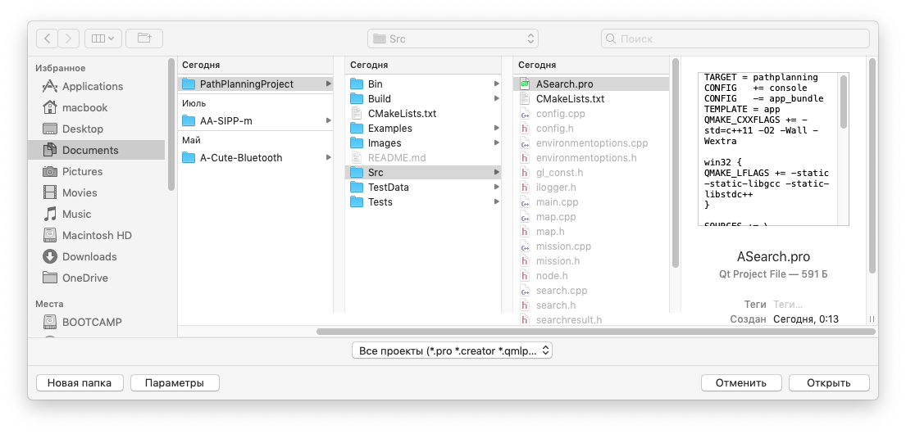

# PathPlanningProject
Исходный код проекта по планированию траекторий.


## О чём этот проект

Данный проект является моей проектной работой в рамках 2 курса ПМИ. Проектом является программа (исходный код), которая принимает на вход карту "поля" и опции нахождения траектории (в формате .XML). Программа считывает карту из входного файла, находит кратчайший путь между двумя заданными точками (если он есть) и дальше выдаёт .XML файл с результатом.

Пример файла на вход и на выход можно найти в папке Examples

## Входные данные

На вход программе подаётся файл .XML файл такого формата:

```
<?xml version="1.0" encoding="UTF-8" ?>
<root>
    <map>
        <width>6</width>        // задаёт ширину поля
        <height>6</height>      // задаёт высоту поля
        <cellsize>24</cellsize> // задаёт размер клетки
        <startx>1</startx>      // координаты начала
        <starty>5</starty>      // координаты начала
        <finishx>5</finishx>    // координаты конца
        <finishy>5</finishy>    // координаты конца
        <grid>                  // поле (где 1 - непроходимая клетка, а 0 - проходимая клетка)
            <row>0 0 0 0 1 0</row>
            <row>0 0 0 0 1 0</row>
            <row>0 1 1 1 0 0</row>
            <row>0 0 0 1 0 0</row>
            <row>0 0 0 1 0 0</row>
            <row>0 0 0 1 0 0</row>
        </grid>
    </map>
    <algorithm>
        <searchtype>astar</searchtype>      // вид поиска (astar или дейкстра)
        <metrictype>diagonal</metrictype>   // метрика (одна из 4 видов)
        <breakingties>g-max</breakingties>  // метод выбор "оптимальной" вершины
        <hweight>1</hweight>                // вес эвристики
        <allowdiagonal>true</allowdiagonal> // разрешён ли переход по диагонали
        <cutcorners>true</cutcorners>       // разрешено ли срезать углы
        <allowsqueeze>true</allowsqueeze>   // разрешено ли проходить через конструкции вида
    </algorithm>                                                                    1 0
    <options>                                                                       0 1
        <loglevel>2</loglevel> // уровень логирования (в данном примере уровень логирования - 2)
        <logpath />
        <logfilename />
    </options>
</root>
```

Подробное описание входных параметров будет позже (с картинками)

## Выходные данные

После работы программы выдаётся .XML файл с результатом работы (к входному файлу добавляется log секция):

```
<?xml version="1.0" encoding="UTF-8" ?>
<root>
    <map>
        *** (аналогично входному файлу)
    </map>
    <algorithm>
        *** (аналогично входному файлу)
    </algorithm>
    <options>
        *** (аналогично входному файлу)
    </options>
    <log>
        <mapfilename>../../Examples/example.xml</mapfilename> // путь к созданному файлу
        <summary numberofsteps="18" nodescreated="27" length="11.656855" length_scaled="279.76453" time="0.000534"/> // параметры найденного пути
        <path>        // "карта" кратчайшего пути
            <row number="0">0 0 0 0 1 0 </row>
            <row number="1">0 * * * 1 0 </row>
            <row number="2">* 1 1 1 * 0 </row>
            <row number="3">* 0 0 1 0 * </row>
            <row number="4">* 0 0 1 0 * </row>
            <row number="5">0 * 0 1 0 * </row>
        </path>
        <lplevel>     // описание кратчайшего пути по вершинам
            <node x="1" y="5" number="0"/>
            <node x="0" y="4" number="1"/>
            <node x="0" y="3" number="2"/>
            <node x="0" y="2" number="3"/>
            <node x="1" y="1" number="4"/>
            <node x="2" y="1" number="5"/>
            <node x="3" y="1" number="6"/>
            <node x="4" y="2" number="7"/>
            <node x="5" y="3" number="8"/>
            <node x="5" y="4" number="9"/>
            <node x="5" y="5" number="10"/>
        </lplevel>
        <hplevel>    // описание кратчайшего пути по секциям (рёбрам)
            <section number="0" start.x="1" start.y="5" finish.x="0" finish.y="4" length="1.4142135623700001"/>
            <section number="1" start.x="0" start.y="4" finish.x="0" finish.y="2" length="2"/>
            <section number="2" start.x="0" start.y="2" finish.x="1" finish.y="1" length="1.4142135623700001"/>
            <section number="3" start.x="1" start.y="1" finish.x="3" finish.y="1" length="2"/>
            <section number="4" start.x="3" start.y="1" finish.x="5" finish.y="3" length="2.8284271247400001"/>
            <section number="5" start.x="5" start.y="3" finish.x="5" finish.y="5" length="2"/>
        </hplevel>
        <lowlevel>
            <step number="0">
                <open>
                    <node x="0" y="4" F="6.8284271247399992" g="1.4142135623700001" parent_x="1" parent_y="5"/>
                    <node x="1" y="4" F="5.4142135623699996" g="1" parent_x="1" parent_y="5"/>
                    <node x="2" y="4" F="4.8284271247400001" g="1.4142135623700001" parent_x="1" parent_y="5"/>
                    <node x="0" y="5" F="6" g="1" parent_x="1" parent_y="5"/>
                    <node x="2" y="5" F="4" g="1" parent_x="1" parent_y="5"/>
                </open>
                <close>
                    <node x="1" y="5" F="4" g="0"/>
                </close>
            </step>
            <step number="1">
             *** (расписывается состояние списков OPEN и CLOSE по шагам)
             Всего кол-во step == number_of_steps - 1 (т.к. отсчёт с 0)
            </step>
        </lowlevel>
    </log>
</root>
```

Детализированность выходного файла зависит от параметра loglevel.

Если loglevel == 0, то выходной файл не создаётся  
Если loglevel не 0, то создаётся выходной файл, в который пишутся секции root/map, root/algorithm и root/options, далее в зависимости от значения loglevel:  
Если loglevel == 0.5, то добавляется summary  
Если loglevel == 1, что было в 0.5 + путь (на гриде и в виде hplevel, lplevel)  
Если loglevel == 1.5, что было в 1 + добавляется тег lowlevel, в который записываются списки OPEN и CLOSED на финальной итерации поиска  
Если loglevel == 2, что было в 1 + lowlevel пишутся OPEN и CLOSED по шагам  
Если loglevel не соответствует одному из данных значений, то ставится значение по умолчанию - 1

## Требования
Для сборки и запуска возможно использовать QMake или CMake. CMakeLists.txt и .pro файлы доступны в репозитории. Для проведения тестирования локально используйте CMake. Подробные требования к ПО указаны ниже. 

### Linux
- Git 2.7.4 или выше
- CMake 3.2 или выше;
- GCC 4.9 или выше;
- Make
- QtCreator и Qt5 (по желанию).

### Mac
- Git 2.23.0 или выше
- CMake 3.2 или выше;
- Apple LLVM version 10.0.0 (clang-1000.11.45.5) или выше;
- Make
- QtCreator и Qt5 (по желанию).

### Windows
- Git 2.23.0 или выше
- CMake 3.2 или выше;
- MinGW-w64 5.0.3 или выше (должен быть добавлен в переменную среды Path);
- QtCreator и Qt5 (по желанию).

### Сборка и запуск

Сборку проекта возможно осуществить двумя способами:
- Используя QtCreator и qmake;
- Используя CMake.
  
При использовании QtCreator требуется открыть файл `ASearch.pro` который находится в директории `.../PathPlanningProject/Src/` и настроить проект с нужным комплектом сборки.



После выбора проекта требуется установить имя входного файла как аргумент командной строки. В качестве первого примера используйте файл `.../PathPlanningProject/Examples/example.xml`. Для установки аргументов командной строки перейдите в настройки запуска проекта и введите нужный путь к файлу в поле "Параметры командной строки".


После установки аргумента командной строки можно проверить работу программы. Следующий результат должен отобразиться в результате запуска:

```
Parsing the map from XML:
Map OK!
Parsing configurations (algorithm, log) from XML:
Log status: short
Warning! Value of 'logpath' tag is missing!
Value of 'logpath' tag was defined to 'current directory'.
Warning! Value of 'logfilename' tag is missing.
Value of 'logfilename' tag was defined to default (original filename +'_log' + original file extension).
Configurations OK!
Creating log channel:
Log OK!
Start searching the path:
Search is finished!
Path found!
numberofsteps=48
nodescreated=84
pathlength=16.0711
pathlength_scaled=385.706
time==0.001448
Results are saved (if chosen) via created log channel.
```

При использовании CMake сборка и запуск может производиться как из командной строки, так и при помощи различных IDE (например JetBrains CLion). Ниже приведены скрипты сборки и запуска с использованием командной строки.

### Linux и Mac
Release сборка:
```bash
cd PathPlanningProject
cd Build
cd Release
cmake ../../ -DCMAKE_BUILD_TYPE="Release"
make
make install
```

Debug сборка:
```bash
cd PathPlanningProject
cd Build
cd Debug
cmake ../../ -DCMAKE_BUILD_TYPE="Debug"
make
make install
```

Запуск:
```bash
cd ../../Bin/{Debug|Release}/
./PathPlanning ../../Examples/example.xml
```
Результат запуска:


### Windows
Release сборка:
```cmd
cd PathPlanningProject
cd Build
cd Release
set PATH
cmake ../../ -DCMAKE_BUILD_TYPE="Release" -G "MinGW Makefiles"
mingw32-make
mingw32-make install
```

Debug сборка:
```cmd
cd PathPlanningProject
cd Build
cd Debug
set PATH
cmake ../../ -DCMAKE_BUILD_TYPE="Debug" -G "MinGW Makefiles"
mingw32-make
mingw32-make install
```

Запуск:
```cmd
cd ../../Bin/{Debug|Release}/
PathPlanning.exe ../../Examples/example.xml
```

Результат запуска:


## Тестирование 
Linux test result:

[](https://travis-ci.com/haiot4105/PathPlanningProject)

Windows test result:

[](https://ci.appveyor.com/project/haiot4105/pathplanningproject/branch/master)

При использовании сборки CMake возможен запуск тестов, как локально, так и с использованием Travis CI и AppVeyor. 
Локальный запуск тестов производится из директории `.../PathPlanningProject/Build/{Debug|Release}/` с помощью команды:
```
 ctest
```

либо (для более подробного вывода):
```
 ctest --output-on-failure
```
При запуска теста c использованием данной программы должен получиться следующий результат:
```
      Start  1: Test1
 1/17 Test  #1: Test1 ............................   Passed    0.09 sec
      Start  2: Test2
 2/17 Test  #2: Test2 ............................   Passed    0.08 sec
      Start  3: Test3
 3/17 Test  #3: Test3 ............................   Passed    0.09 sec
      Start  4: Test4
 4/17 Test  #4: Test4 ............................   Passed    0.09 sec
      Start  5: Test5
 5/17 Test  #5: Test5 ............................   Passed    0.09 sec
      Start  6: Test6
 6/17 Test  #6: Test6 ............................   Passed    0.09 sec
      Start  7: Test7
 7/17 Test  #7: Test7 ............................   Passed    0.09 sec
      Start  8: Test8
 8/17 Test  #8: Test8 ............................   Passed    0.09 sec
      Start  9: Test9
 9/17 Test  #9: Test9 ............................   Passed    0.09 sec
      Start 10: Test10
 10/17 Test #10: Test10 ..........................   Passed    0.09 sec
      Start 11: Test11
 11/17 Test #11: Test11 ..........................   Passed    0.08 sec
      Start 12: Test12
 12/17 Test #12: Test12 ..........................   Passed    0.08 sec
      Start 13: Test13
 13/17 Test #13: Test13 ..........................   Passed    0.00 sec
      Start 14: Test14
 14/17 Test #14: Test14 ..........................   Passed    0.00 sec
      Start 15: Test15
 15/17 Test #15: Test15 ..........................   Passed    0.00 sec
      Start 16: Test16
 16/17 Test #16: Test16 ..........................   Passed    0.00 sec
      Start 17: Test17
 17/17 Test #17: Test17 ..........................   Passed    0.30 sec

100% tests passed, 0 tests failed out of 17

Total Test time (real) =  1.40 sec

Build success
```
Для корректного тестирования необходимо поддерживать файлы CMakeLists.txt в актуальном состоянии.

Для удаленного тестирования и получения "плашки" о проведении тестирования следует подключить сервисы TravisCI и AppVeyor к репозиторию. Файлы `.travis.yml` и `.appveyor.yml` доступны в репозитории. После активации сервисов тестирование будет проводиться после каждого коммита в репозиторий GitHub. Подробная информация о тестировании будет доступна в личном кабинете соответствующего сервиса. [Подробнее об удаленном тестировании](https://habr.com/ru/post/329264/).

## Контакты
**Новиков Георгий Денисович**
- gdnovikov@edu.hse.ru, gosha22397@yandex.ru
- Telegram: @gosha22397
